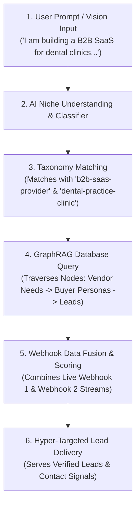
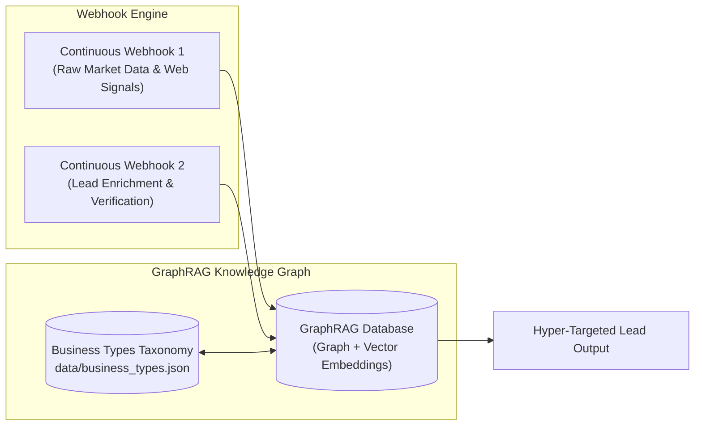

# SignalMind — AI-Driven Lead Generation Platform

## Project Context & AI Agent Specification

> **Version:** 1.0.0  
> **Environment:** `data/` (Isolated Data & Context Workspace)  
> **Target Audience for this document:** AI Coding Agents, Autonomous System Builders, & System Architects  

---

## 1. Executive Summary & Value Proposition

**SignalMind** is an AI-driven, hyper-targeted lead generation platform designed for modern entrepreneurs, founders, and business builders. 

### Core Value Proposition
Building a business requires finding the right customers quickly. Instead of relying on static database filters or outdated lead lists, SignalMind allows users to simply **describe the business they are trying to build in natural language**. SignalMind’s intelligent backend parses their vision, accurately maps their niche against an extensive taxonomy of business types, and queries a dynamic **GraphRAG (Graph Retrieval-Augmented Generation)** knowledge graph to deliver hyper-targeted, high-converting business leads.

---

## 2. Core User Journey



1. **User Onboarding / Input:** A user visits the platform and describes their business idea, service offering, or product concept in freeform text.
2. **Niche Understanding:** AI agents parse the input to extract core intent, target audience parameters, value propositions, and industry verticals.
3. **Taxonomy & Graph Mapping:** The platform queries `data/business_types.json` (200 curated business types) to identify matching categories, buyer personas, sales cycles, and graph entities.
4. **GraphRAG Querying:** The backend queries the GraphRAG database to traverse relationships between business types, vendor needs, and lead profiles.
5. **Hyper-Targeted Lead Delivery:** The user is served a curated list of verified, highly relevant business leads complete with decision-maker contact vectors and context signals.

---

## 3. System Architecture & Component Division

The repository is modularly split to ensure parallel development by multiple AI agents:

```
SignalMind Repository Structure:
├── stitch_landing_page.html   # Managed by Landing Page Agent (UI/UX)
├── assets/                    # Shared static assets for frontend
└── data/                      # Managed by Data & GraphRAG Agent (ISOLATED WORKSPACE)
    ├── business_types.json    # JSON Database of 200 Business Types & Metadata
    ├── PROJECT_CONTEXT.md     # Primary AI Context & Technical Specifications (This File)
    ├── generate_all_200.py    # Database Builder & Generator Script
    └── verify_data.py         # Automated Schema & Integrity Validator
```

> [!IMPORTANT]
> **Separation of Concerns:** All work related to business data taxonomy, GraphRAG structures, context definition, and backend dataset schemas MUST remain strictly within the `data/` directory to avoid interfering with ongoing frontend and landing page development in the root directory.

---

## 4. Backend Webhook Architecture & GraphRAG Pipeline

The SignalMind intelligence engine is powered by **two continuous, real-time webhooks** feeding a centralized **GraphRAG Database**:



### 1. Webhook 1: Continuous Market & Signal Ingestion
* **Function:** Ingests live web signals, newly registered business domains, company funding announcements, job postings, technographic changes, and social intent signals.
* **Role:** Continuously updates the graph nodes with fresh entities across all 200 business categories.

### 2. Webhook 2: Continuous Lead Enrichment & Verification
* **Function:** Enriches ingested business entities with executive decision-maker profiles (LinkedIn, emails, direct dials), verifies email deliverability, and calculates lead intent scores.
* **Role:** Ensures zero stale data and high deliverability for clients.

### 3. Graph Retrieval-Augmented Generation (GraphRAG)
* **Node Types:** `Business Type`, `Industry Category`, `Target Persona`, `Vendor Need`, `Technology Tool`, `Lead Entity`.
* **Edge Relationships:** 
  * `(Business Type) -[:TARGETS]-> (Buyer Persona)`
  * `(Business Type) -[:REQUIRES_VENDOR]-> (Vendor Need)`
  * `(Lead Entity) -[:INSTANTIATES]-> (Business Type)`
  * `(Lead Entity) -[:EXHIBITS_INTENT]-> (Target Persona)`
* **GraphRAG Benefit:** Enables contextual multi-hop traversal. For example, if a user is building an *AI Automation Agency*, GraphRAG identifies that *Commercial Roofing Contractors* have a vendor need for *Automated Call Dispatching*, linking them to roofing leads exhibiting dispatch pain points.

---

## 5. Business Types Database Schema (`data/business_types.json`)

The dataset in `data/business_types.json` consists of **200 distinct business types** categorized across 12 major industry verticals:

### Industry Category Distribution (200 Total)
| Category | Business Count | Examples |
| :--- | :---: | :--- |
| **Technology & Software** | 20 | B2B SaaS, AI/ML Agency, Cybersecurity, DevOps Agency |
| **Professional Services & Consulting** | 20 | Management Consulting, Fractional CFO, Executive Search |
| **Construction, Building & Trades** | 20 | Commercial Roofing, HVAC, Solar Installation, General Contractor |
| **Healthcare, Medical & Wellness** | 20 | MedSpa, Dental Practice, Physical Therapy, Telehealth |
| **Marketing, Media & Creative Agencies** | 20 | SEO Agency, PPC Agency, Video Production, Branding Studio |
| **Retail, E-Commerce & Consumer Brands** | 20 | D2C Apparel, Specialty Coffee, Luxury Goods, Pet Accessories |
| **Real Estate, Property & Facility Mgmt** | 15 | Commercial CRE, Property Management, Title Services |
| **Financial Services, Legal & Insurance** | 15 | Wealth Management, Commercial Insurance, CPA Firm |
| **Education, Coaching & Training** | 15 | Executive Coaching, Coding Bootcamp, Corporate Training |
| **Manufacturing, Supply Chain & Industrial** | 15 | CNC Machining, 3PL Warehousing, Freight Brokerage |
| **Hospitality, Food & Entertainment** | 10 | Boutique Hotel, Event Catering, Yacht Charter |
| **Personal Services & Lifestyle** | 10 | Interior Design Studio, Wedding Photography, Mobile Pet Grooming |

### JSON Entity Schema Reference
Each entry in `business_types.json` strictly adheres to the following JSON structure:

```json
{
  "id": "b2b-saas-provider",
  "name": "B2B Software-as-a-Service (SaaS)",
  "category": "Technology & Software",
  "sub_category": "Cloud Software",
  "business_model": "B2B",
  "description": "Companies providing cloud-based software tools for business operations, productivity, or enterprise workflows.",
  "target_audience": "Mid-market to Enterprise Operations, IT, and Department Heads",
  "ideal_buyer_personas": [
    "CTO",
    "VP of Engineering",
    "Head of Operations",
    "CIO"
  ],
  "lead_generation_channels": [
    "LinkedIn Cold Outreach",
    "Account-Based Marketing (ABM)",
    "SEO & Content Marketing"
  ],
  "typical_ticket_size": "High ($10k - $100k+ ARR)",
  "sales_cycle": "3 to 9 months",
  "graph_nodes": {
    "related_industries": ["Enterprise Software", "Cloud Infrastructure"],
    "common_vendor_needs": ["SOC2 Compliance Auditors", "DevOps Consultants", "B2B Growth Agencies"],
    "common_client_types": ["Mid-Market Companies", "Fast-Growing Startups"]
  },
  "search_keywords": ["saas", "b2b software", "cloud application", "subscription software"]
}
```

---

## 6. Protocols & Guidelines for AI Agents

When building features or extending the SignalMind platform, AI agents must adhere to the following rules:

1. **Context First:** Always read this file (`data/PROJECT_CONTEXT.md`) and validate database contents using `data/verify_data.py`.
2. **Directory Isolation:** Do not edit frontend artifacts (`stitch_landing_page.html`, `assets/`) unless explicitly assigned to the landing page role.
3. **Data Integrity:** Any modification to business types must maintain all required schema keys: `id`, `name`, `category`, `sub_category`, `business_model`, `description`, `target_audience`, `ideal_buyer_personas`, `lead_generation_channels`, `typical_ticket_size`, `sales_cycle`, `graph_nodes`, and `search_keywords`.
4. **GraphRAG Consistency:** When querying or extending graph node relationships, utilize the `graph_nodes` object (`related_industries`, `common_vendor_needs`, `common_client_types`) to maintain multi-hop link accuracy.

---

*SignalMind AI Data & Context Engine — Maintained in `e:\SignalMind\data`*
